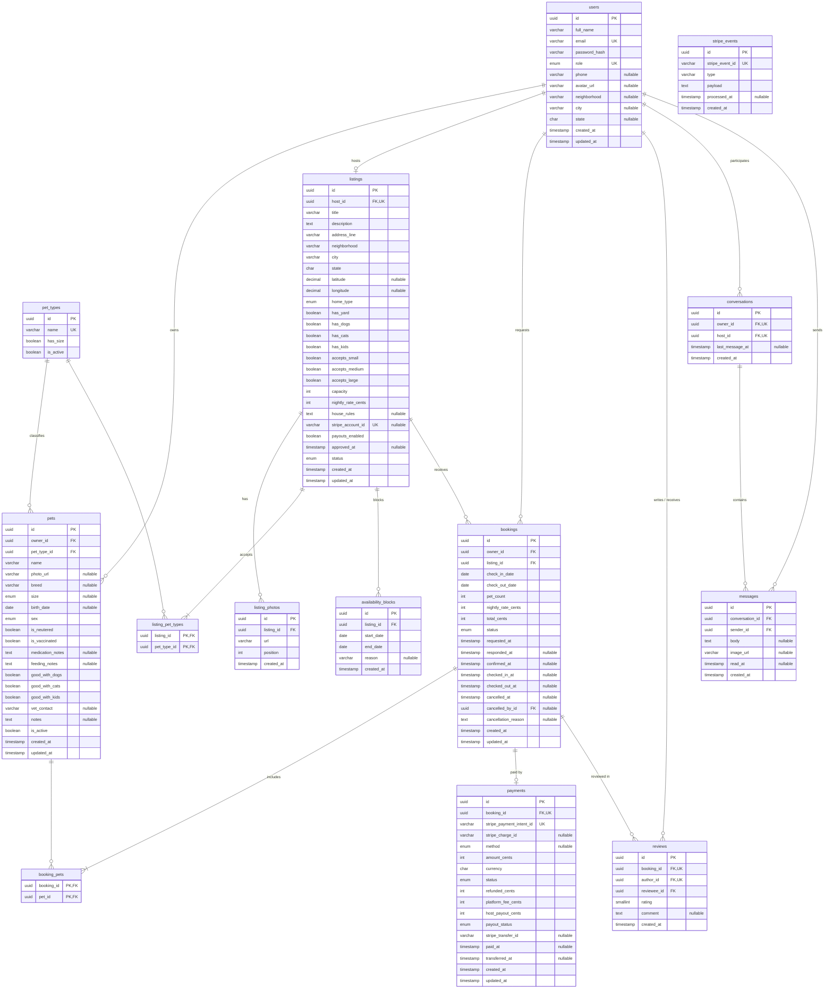
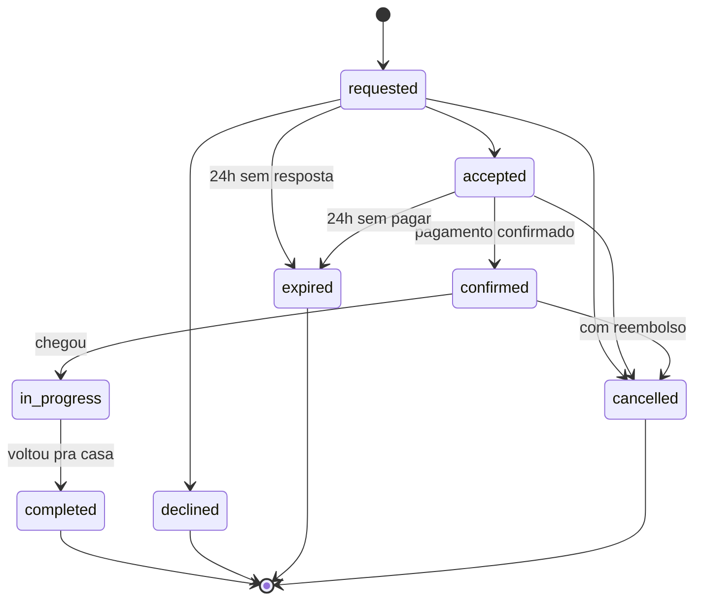

# PetHost — Dicionário de dados

_Modelo lógico do MVP · 14 tabelas · outubro de 2026 · complementa o [`escopo-mvp.md`](escopo-mvp.md)_

Este documento explica cada tabela e cada coluna do banco: o que guarda, por que existe e quais regras valem. O banco ainda não foi escolhido (PostgreSQL ou SQL Server), então os tipos são genéricos; a seção 1 mostra como cada um vira tipo real.

## Sumário

1. [Legenda](#1-legenda)
2. [Convenções de nome](#2-convenções-de-nome)
3. [Glossário](#3-glossário)
4. [Diagrama](#4-diagrama)
5. [Tabelas e colunas](#5-tabelas-e-colunas)
6. [Relacionamentos](#6-relacionamentos)
7. [Valores dos enums](#7-valores-dos-enums)
8. [Referências](#8-referências)

## 1. Legenda

### Chaves e marcações

| Marca | Significado |
|---|---|
| `PK` | Chave primária. Identifica a linha. Duas PK na mesma tabela = chave composta (tabelas associativas). |
| `FK` | Chave estrangeira. Aponta para o `id` de outra tabela. |
| `UK` | Valor único. UK¹, UK², UK³: colunas com o mesmo número formam juntas uma combinação única. |
| Nulo = sim | A coluna pode ficar vazia. No diagrama Mermaid aparece como `"nullable"`. |

### Linhas do diagrama (pé-de-galinha)

| Símbolo (Mermaid) | Lê-se |
|---|---|
| `\|\|` | exatamente um |
| `o\|` | zero ou um |
| `\|{` | um ou muitos |
| `o{` | zero ou muitos |

Exemplo: `users ||--o{ pets` lê-se "um usuário tem zero ou muitos pets; cada pet tem exatamente um usuário".

### Tipos

| Tipo no dicionário | O que é | PostgreSQL | SQL Server |
|---|---|---|---|
| `uuid` | Identificador único de 128 bits (todas as PKs e FKs) | `uuid` | `uniqueidentifier` |
| `int` / `smallint` | Número inteiro | `integer` / `smallint` | `int` / `smallint` |
| `varchar(n)` | Texto curto com limite | `varchar(n)` | `nvarchar(n)` |
| `char(n)` | Texto de tamanho fixo (UF, moeda) | `char(n)` | `nchar(n)` |
| `text` | Texto longo | `text` | `nvarchar(max)` |
| `boolean` | Sim ou não | `boolean` | `bit` |
| `date` | Só a data | `date` | `date` |
| `timestamp` | Data e hora, sempre em UTC | `timestamptz` | `datetime2` |
| `decimal(p,s)` | Número com casas fixas (coordenadas) | `numeric(p,s)` | `decimal(p,s)` |
| `enum` | Lista fechada de valores (seção 7) | `varchar` + `check` | `nvarchar` + `check` |

## 2. Convenções de nome

Os nomes seguem o padrão mais comum em projetos atuais. A regra de ouro: **um jeito só, aplicado em tudo**.

| Regra | Exemplo | Por quê |
|---|---|---|
| Inglês, minúsculo, snake_case | `check_in_date` | Funciona igual em qualquer banco e não precisa de aspas no PostgreSQL. |
| Tabela no plural | `bookings`, `pets` | Uma tabela é um conjunto de registros. |
| Tabela associativa = as duas entidades, plural no fim | `booking_pets` | Mostra quem liga com quem. |
| PK sempre `id` | `id` | Simples e previsível. |
| PK é `uuid` v7, gerado pela aplicação (nunca auto-incremento) | `0199c5a2-7f3e-7a41-9b1c-2d4e6f8a0b1c` | Não expõe quantos registros existem nem deixa adivinhar o id vizinho; a entidade nasce com id antes do insert; v7 é ordenado por tempo, então o índice não fragmenta como com v4. FKs seguem o mesmo tipo. |
| FK = entidade no singular + `_id` | `listing_id` | Dá para saber para onde aponta só pelo nome. |
| FK para `users` leva o papel | `owner_id`, `host_id`, `author_id` | Deixa claro quem é quem quando há dois usuários na mesma linha. |
| Booleanos como pergunta | `is_active`, `has_yard`, `accepts_large` | Lê-se como sim/não. |
| Data e hora termina em `_at` | `paid_at`, `created_at` | Instantes no tempo, em UTC. |
| Só data termina em `_date` | `check_in_date` | Dias do calendário, sem hora. |
| Dinheiro em centavos inteiros, termina em `_cents` | `total_cents = 30000` | Evita erro de arredondamento e é o formato do Stripe. |
| IDs externos com prefixo do serviço | `stripe_payment_intent_id` | Separa o id do Stripe do nosso. |
| Tabelas principais têm `created_at` e `updated_at` |  | Auditoria e depuração. |
| Valores de enum em inglês minúsculo | `in_progress` | O texto em português fica na tela, não no banco. |

**No código C#:** as entidades seguem o padrão do .NET (PascalCase, singular): `Booking`, `CheckInDate`, `ListingId`. O pacote `EFCore.NamingConventions` com `UseSnakeCaseNamingConvention()` converte para `bookings` e `check_in_date` no banco, sem configurar coluna por coluna.

## 3. Glossário

| No app (português) | No banco | Observação |
|---|---|---|
| Tutor | `users.role = owner` | "Owner" é o termo usado por plataformas de pet sitting. |
| Anfitrião | `users.role = host` |  |
| Cantinho | `listings` | Mesmo termo usado pelo Airbnb para o anúncio. |
| Reserva / estadia | `bookings` |  |
| Ficha do pet | `pets` |  |
| Tipo de pet | `pet_types` |  |
| Agenda bloqueada | `availability_blocks` |  |
| Pagamento e repasse | `payments` | Repasse = payout; taxa da plataforma = platform fee. |
| Conversa · Mensagem | `conversations` · `messages` |  |
| Avaliação | `reviews` | Quem avalia: author. Quem é avaliado: reviewee. |

## 4. Diagrama

_Versão em imagem, com tamanhos dos campos: [`er.png`](er.png)._

## 5. Tabelas e colunas

Na ordem do fluxo: contas e pets, depois o anfitrião, depois a reserva e o pagamento, por fim o chat e as avaliações.

### `users` · Usuários

Toda conta do sistema: tutores, anfitriões e administradores. O tipo da conta (role) é escolhido no cadastro e não muda. A mesma pessoa pode ter uma conta de tutor e outra de anfitrião com o mesmo e-mail.

| Coluna | Tipo | Chave | Nulo | Descrição |
|---|---|---|---|---|
| `id` | `uuid` | `PK` | não | Identificador da conta. |
| `full_name` | `varchar(120)` |  | não | Nome completo. |
| `email` | `varchar(160)` | `UK¹` | não | E-mail de login. Único junto com role. |
| `password_hash` | `varchar(255)` |  | não | Hash da senha (nunca a senha em texto). |
| `role` | `enum` | `UK¹` | não | Tipo da conta: owner (tutor), host (anfitrião) ou admin. |
| `phone` | `varchar(20)` |  | sim | Telefone com DDD, só dígitos (ex.: 44999990000). Só é mostrado ao outro lado depois do pagamento. |
| `avatar_url` | `varchar(500)` |  | sim | Foto de perfil. URL absoluta http/https. |
| `neighborhood` | `varchar(80)` |  | sim | Bairro. Usado no selo "Vizinho" e na busca. |
| `city` | `varchar(80)` |  | sim | Cidade. |
| `state` | `char(2)` |  | sim | UF, ex.: PR. Só as 27 UFs válidas, em maiúsculas. |
| `created_at` | `timestamp` |  | não | Quando o registro foi criado (UTC). |
| `updated_at` | `timestamp` |  | não | Última alteração do registro (UTC). |

> Índice único (`email, role`).
>
> O admin é criado direto no banco (`seed`).

### `pet_types` · Tipos de pet

Lista de tipos de animal aceitos na plataforma. Mantida pelo admin. Começa com Cachorro, Gato e Pequenos animais.

| Coluna | Tipo | Chave | Nulo | Descrição |
|---|---|---|---|---|
| `id` | `uuid` | `PK` | não | Identificador do tipo. |
| `name` | `varchar(40)` | `UK` | não | Nome exibido, ex.: Cachorro. |
| `has_size` | `boolean` |  | não | Se true, o pet desse tipo informa porte (P, M, G). Só Cachorro no MVP. |
| `is_active` | `boolean` |  | não | Tipos desativados somem do cadastro, mas pets antigos continuam válidos. |

### `pets` · Pets

A ficha do animal. Pertence a um tutor e vai junto com cada reserva para o anfitrião ler antes de aceitar.

| Coluna | Tipo | Chave | Nulo | Descrição |
|---|---|---|---|---|
| `id` | `uuid` | `PK` | não | Identificador do pet. |
| `owner_id` | `uuid` | `FK` | não | Tutor dono do pet → users.id (role = owner). |
| `pet_type_id` | `uuid` | `FK` | não | Tipo do pet → pet_types.id. |
| `name` | `varchar(60)` |  | não | Nome do pet. O produto usa sempre o nome ("A Pipoca chegou!"). |
| `photo_url` | `varchar(500)` |  | sim | Foto do pet. |
| `breed` | `varchar(60)` |  | sim | Raça em texto livre. Vazio = sem raça definida. |
| `size` | `enum` |  | sim | Porte: small, medium, large. Obrigatório quando pet_types.has_size. |
| `birth_date` | `date` |  | sim | Nascimento aproximado. A idade é calculada. |
| `sex` | `enum` |  | não | male ou female. |
| `is_neutered` | `boolean` |  | não | Castrado. |
| `is_vaccinated` | `boolean` |  | não | Vacinas em dia. |
| `medication_notes` | `text` |  | sim | Remédio, dose e horário. Se preenchido, o tutor confirma que vai entregar o remédio. |
| `feeding_notes` | `text` |  | sim | Rotina de alimentação. A ração é sempre levada pelo tutor. |
| `good_with_dogs` | `boolean` |  | não | Convive bem com cães. Usado no "Combina com seu pet". |
| `good_with_cats` | `boolean` |  | não | Convive bem com gatos. |
| `good_with_kids` | `boolean` |  | não | Convive bem com crianças. |
| `vet_contact` | `varchar(160)` |  | sim | Veterinário de confiança (nome e telefone). |
| `notes` | `text` |  | sim | "Coisas que só quem convive sabe": medos, manias, comandos. |
| `is_active` | `boolean` |  | não | Pets com histórico são desativados, nunca apagados. |
| `created_at` | `timestamp` |  | não | Quando o registro foi criado (UTC). |
| `updated_at` | `timestamp` |  | não | Última alteração do registro (UTC). |

### `listings` · Cantinhos

O espaço que o anfitrião oferece (no app: "cantinho"). Um por conta de anfitrião. Também guarda a ligação com a conta Stripe Connect, que é a verificação do anfitrião.

| Coluna | Tipo | Chave | Nulo | Descrição |
|---|---|---|---|---|
| `id` | `uuid` | `PK` | não | Identificador do cantinho. |
| `host_id` | `uuid` | `FK UK` | não | Anfitrião dono → users.id (role = host). Único: um cantinho por conta. |
| `title` | `varchar(80)` |  | não | Título, ex.: "Casa com quintal no Jardim Alvorada". |
| `description` | `text` |  | não | Descrição livre da casa e da rotina. |
| `address_line` | `varchar(200)` |  | não | Endereço completo. Só aparece para o tutor após o pagamento. |
| `neighborhood` | `varchar(80)` |  | não | Bairro. É o que aparece na busca. |
| `city` | `varchar(80)` |  | não | Cidade. |
| `state` | `char(2)` |  | não | UF. |
| `latitude` | `decimal(9,6)` |  | sim | Para calcular a distância ("2 km de você"). |
| `longitude` | `decimal(9,6)` |  | sim | Idem. |
| `home_type` | `enum` |  | não | house ou apartment. |
| `has_yard` | `boolean` |  | não | Tem quintal. Gera o selo "Casa com quintal". |
| `has_dogs` | `boolean` |  | não | Tem cães em casa. Usado no "Combina com seu pet". |
| `has_cats` | `boolean` |  | não | Tem gatos em casa. |
| `has_kids` | `boolean` |  | não | Tem crianças em casa. |
| `accepts_small` | `boolean` |  | não | Aceita porte pequeno (vale para tipos com porte). |
| `accepts_medium` | `boolean` |  | não | Aceita porte médio. |
| `accepts_large` | `boolean` |  | não | Aceita porte grande. |
| `capacity` | `int` |  | não | Quantos pets ao mesmo tempo, somando todos os tutores. |
| `nightly_rate_cents` | `int` |  | não | Diária por pet, em centavos (6000 = R$ 60,00). |
| `house_rules` | `text` |  | sim | Regras da casa. |
| `stripe_account_id` | `varchar(255)` | `UK` | sim | ID da conta conectada no Stripe (acct_...). |
| `payouts_enabled` | `boolean` |  | não | Espelha o Stripe: true quando a conta pode receber repasses. |
| `approved_at` | `timestamp` |  | sim | Quando o admin aprovou. Nulo = aguardando. |
| `status` | `enum` |  | não | draft, active ou paused. Só active + payouts_enabled + approved_at aparece na busca. |
| `created_at` | `timestamp` |  | não | Quando o registro foi criado (UTC). |
| `updated_at` | `timestamp` |  | não | Última alteração do registro (UTC). |

> Índice em (`city, neighborhood, status`) para a busca.

### `listing_photos` · Fotos do cantinho

Fotos do cantinho, em ordem. Até 5 por cantinho.

| Coluna | Tipo | Chave | Nulo | Descrição |
|---|---|---|---|---|
| `id` | `uuid` | `PK` | não | Identificador da foto. |
| `listing_id` | `uuid` | `FK` | não | Cantinho → listings.id. |
| `url` | `varchar(500)` |  | não | Caminho do arquivo. |
| `position` | `int` |  | não | Ordem de exibição (0 = capa). |
| `created_at` | `timestamp` |  | não | Quando o registro foi criado (UTC). |

### `listing_pet_types` · Tipos aceitos

Tabela associativa: quais tipos de pet cada cantinho aceita (N:N).

| Coluna | Tipo | Chave | Nulo | Descrição |
|---|---|---|---|---|
| `listing_id` | `uuid` | `PK FK` | não | Cantinho → listings.id. |
| `pet_type_id` | `uuid` | `PK FK` | não | Tipo aceito → pet_types.id. |

### `availability_blocks` · Bloqueios de agenda

Períodos em que o anfitrião fechou a agenda. Por padrão tudo está disponível.

| Coluna | Tipo | Chave | Nulo | Descrição |
|---|---|---|---|---|
| `id` | `uuid` | `PK` | não | Identificador do bloqueio. |
| `listing_id` | `uuid` | `FK` | não | Cantinho → listings.id. |
| `start_date` | `date` |  | não | Primeiro dia bloqueado. |
| `end_date` | `date` |  | não | Último dia bloqueado (inclusive). |
| `reason` | `varchar(120)` |  | sim | Motivo opcional, só para o anfitrião. |
| `created_at` | `timestamp` |  | não | Quando o registro foi criado (UTC). |

### `bookings` · Reservas

Uma estadia: um tutor, um cantinho, um período e um ou mais pets. Guarda o ciclo de status e uma cópia do preço no momento do pedido.

| Coluna | Tipo | Chave | Nulo | Descrição |
|---|---|---|---|---|
| `id` | `uuid` | `PK` | não | Identificador da reserva. |
| `owner_id` | `uuid` | `FK` | não | Tutor que pediu → users.id. |
| `listing_id` | `uuid` | `FK` | não | Cantinho → listings.id. |
| `check_in_date` | `date` |  | não | Dia de chegada. |
| `check_out_date` | `date` |  | não | Dia de saída. Deve ser maior que check_in_date. |
| `pet_count` | `int` |  | não | Quantidade de pets (igual às linhas em booking_pets). |
| `nightly_rate_cents` | `int` |  | não | Cópia da diária no momento do pedido. |
| `total_cents` | `int` |  | não | Diária × noites × pets. |
| `status` | `enum` |  | não | requested, accepted, confirmed, in_progress, completed, declined, expired, cancelled. |
| `requested_at` | `timestamp` |  | não | Quando o tutor pediu. Base do prazo de 24h e do selo "Responde rápido". |
| `responded_at` | `timestamp` |  | sim | Quando o anfitrião aceitou ou recusou. |
| `confirmed_at` | `timestamp` |  | sim | Quando o pagamento foi confirmado. |
| `checked_in_at` | `timestamp` |  | sim | Quando o anfitrião marcou "chegou". |
| `checked_out_at` | `timestamp` |  | sim | Quando marcou "voltou pra casa". Libera repasse e avaliações. |
| `cancelled_at` | `timestamp` |  | sim | Quando foi cancelada. |
| `cancelled_by_id` | `uuid` | `FK` | sim | Quem cancelou → users.id. |
| `cancellation_reason` | `text` |  | sim | Motivo do cancelamento ou da expiração. |
| `created_at` | `timestamp` |  | não | Quando o registro foi criado (UTC). |
| `updated_at` | `timestamp` |  | não | Última alteração do registro (UTC). |

> Índice em (`listing_id, check_in_date, check_out_date`) para checar capacidade e disponibilidade.

### `booking_pets` · Pets da reserva

Tabela associativa: quais pets vão em cada reserva (N:N).

| Coluna | Tipo | Chave | Nulo | Descrição |
|---|---|---|---|---|
| `booking_id` | `uuid` | `PK FK` | não | Reserva → bookings.id. |
| `pet_id` | `uuid` | `PK FK` | não | Pet → pets.id. Precisa ser do mesmo tutor da reserva. |

### `payments` · Pagamentos

O pagamento de uma reserva no Stripe e o repasse ao anfitrião. Valores em centavos, como o próprio Stripe trabalha.

| Coluna | Tipo | Chave | Nulo | Descrição |
|---|---|---|---|---|
| `id` | `uuid` | `PK` | não | Identificador do pagamento. |
| `booking_id` | `uuid` | `FK UK` | não | Reserva → bookings.id. Um pagamento por reserva. |
| `stripe_payment_intent_id` | `varchar(255)` | `UK` | não | ID do PaymentIntent (pi_...). |
| `stripe_charge_id` | `varchar(255)` |  | sim | ID da cobrança (ch_...). Usado como origem da transferência. |
| `method` | `enum` |  | sim | card ou pix. Preenchido quando o tutor paga. |
| `amount_cents` | `int` |  | não | Valor cobrado do tutor. |
| `currency` | `char(3)` |  | não | Sempre brl no MVP. |
| `status` | `enum` |  | não | pending, succeeded, failed, refunded, partially_refunded. |
| `refunded_cents` | `int` |  | não | Quanto foi devolvido ao tutor (0 se nada). |
| `platform_fee_cents` | `int` |  | não | 10% do valor retido. Fica com o PetHost. |
| `host_payout_cents` | `int` |  | não | 90% do valor retido. Vai para o anfitrião. |
| `payout_status` | `enum` |  | não | held (guardado), transferred (repassado) ou canceled (não haverá repasse). |
| `stripe_transfer_id` | `varchar(255)` |  | sim | ID da transferência ao anfitrião (tr_...). |
| `paid_at` | `timestamp` |  | sim | Quando o Stripe confirmou o pagamento. |
| `transferred_at` | `timestamp` |  | sim | Quando o repasse foi feito. |
| `created_at` | `timestamp` |  | não | Quando o registro foi criado (UTC). |
| `updated_at` | `timestamp` |  | não | Última alteração do registro (UTC). |

> Regra: platform_fee_cents + host_payout_cents = amount_cents − refunded_cents.

### `stripe_events` · Eventos do Stripe

Registro dos webhooks recebidos. O Stripe pode mandar o mesmo evento mais de uma vez; esta tabela garante que cada um seja processado só uma vez.

| Coluna | Tipo | Chave | Nulo | Descrição |
|---|---|---|---|---|
| `id` | `uuid` | `PK` | não | Identificador interno. |
| `stripe_event_id` | `varchar(255)` | `UK` | não | ID do evento no Stripe (evt_...). |
| `type` | `varchar(80)` |  | não | Tipo, ex.: payment_intent.succeeded. |
| `payload` | `text` |  | não | Corpo do evento em JSON, para depuração. |
| `processed_at` | `timestamp` |  | sim | Quando foi processado. Nulo = ainda não. |
| `created_at` | `timestamp` |  | não | Quando o registro foi criado (UTC). |

### `conversations` · Conversas

O chat entre um tutor e um anfitrião. Uma conversa por dupla, que serve antes, durante e depois das reservas.

| Coluna | Tipo | Chave | Nulo | Descrição |
|---|---|---|---|---|
| `id` | `uuid` | `PK` | não | Identificador da conversa. |
| `owner_id` | `uuid` | `FK UK²` | não | Tutor → users.id. |
| `host_id` | `uuid` | `FK UK²` | não | Anfitrião → users.id. |
| `last_message_at` | `timestamp` |  | sim | Data da última mensagem, para ordenar a lista. |
| `created_at` | `timestamp` |  | não | Quando o registro foi criado (UTC). |

> Índice único (`owner_id, host_id`).

### `messages` · Mensagens

Cada mensagem do chat. Pode ter texto, foto ou os dois. Durante a estadia, as fotos daqui fazem o papel de diário.

| Coluna | Tipo | Chave | Nulo | Descrição |
|---|---|---|---|---|
| `id` | `uuid` | `PK` | não | Identificador da mensagem. |
| `conversation_id` | `uuid` | `FK` | não | Conversa → conversations.id. |
| `sender_id` | `uuid` | `FK` | não | Quem enviou → users.id (o tutor ou o anfitrião da conversa). |
| `body` | `text` |  | sim | Texto. Pelo menos body ou image_url precisa existir. |
| `image_url` | `varchar(500)` |  | sim | Foto anexada. |
| `read_at` | `timestamp` |  | sim | Quando o destinatário leu. Nulo = não lida (contador). |
| `created_at` | `timestamp` |  | não | Quando o registro foi criado (UTC). |

> Índice em (`conversation_id, created_at`).

### `reviews` · Avaliações

Avaliação feita depois da reserva concluída. Cada lado avalia o outro uma vez.

| Coluna | Tipo | Chave | Nulo | Descrição |
|---|---|---|---|---|
| `id` | `uuid` | `PK` | não | Identificador da avaliação. |
| `booking_id` | `uuid` | `FK UK³` | não | Reserva avaliada → bookings.id (status completed). |
| `author_id` | `uuid` | `FK UK³` | não | Quem avaliou → users.id. |
| `reviewee_id` | `uuid` | `FK` | não | Quem foi avaliado → users.id. |
| `rating` | `smallint` |  | não | Nota inteira de 1 a 5. |
| `comment` | `text` |  | sim | Comentário público. |
| `created_at` | `timestamp` |  | não | Quando o registro foi criado (UTC). |

> Índice único (`booking_id, author_id`). Prazo: até 7 dias após checked_out_at.

## 6. Relacionamentos

| De | Para | Cardinalidade | Observação |
|---|---|---|---|
| `users` | `pets` | 1 : N | Só contas owner têm pets. |
| `pet_types` | `pets` | 1 : N | size só é preenchido se has_size. |
| `users` | `listings` | 1 : 0..1 | Uma conta host tem no máximo um cantinho. |
| `listings` | `listing_photos` | 1 : N | Até 5 fotos. |
| `listings` | `pet_types` (via `listing_pet_types`) | N : N | Com pet_types, via listing_pet_types. |
| `listings` | `availability_blocks` | 1 : N | Períodos fechados pelo anfitrião. |
| `users` | `bookings` | 1 : N | O tutor faz várias reservas. |
| `listings` | `bookings` | 1 : N | Várias no mesmo período, limitadas por capacity. |
| `bookings` | `pets` (via `booking_pets`) | N : N | Com pets, via booking_pets. |
| `bookings` | `payments` | 1 : 0..1 | Criado quando o tutor vai pagar. |
| `bookings` | `reviews` | 1 : 0..2 | Uma por lado. |
| `users` | `reviews` | 1 : N | author_id e reviewee_id. |
| `users` | `conversations` | 1 : N | owner_id e host_id; uma por dupla. |
| `conversations` | `messages` | 1 : N |  |
| `users` | `messages` | 1 : N | sender_id. |

## 7. Valores dos enums

| Coluna | Valores no banco | Na tela |
|---|---|---|
| `users.role` | `owner` · `host` · `admin` | Tutor · Anfitrião · Admin |
| `pets.size` | `small` · `medium` · `large` | P · M · G |
| `pets.sex` | `male` · `female` | Macho · Fêmea |
| `listings.home_type` | `house` · `apartment` | Casa · Apartamento |
| `listings.status` | `draft` · `active` · `paused` | Rascunho · Ativo · Pausado |
| `bookings.status` | `requested` · `accepted` · `confirmed` · `in_progress` · `completed` · `declined` · `expired` · `cancelled` | Solicitada · Aceita · Confirmada · Em andamento · Concluída · Recusada · Expirada · Cancelada |
| `payments.method` | `card` · `pix` | Cartão · Pix |
| `payments.status` | `pending` · `succeeded` · `failed` · `refunded` · `partially_refunded` | Pendente · Pago · Falhou · Estornado · Estornado parcial |
| `payments.payout_status` | `held` · `transferred` · `canceled` | Retido · Repassado · Sem repasse |

**Ciclo de `bookings.status`:**

## 8. Referências

- [Bytebase: PostgreSQL SQL Review and Style Guide](https://www.bytebase.com/blog/postgres-sql-review-guide/)
- [Bytebase: SQL Table Naming Dilemma: Singular vs. Plural](https://www.bytebase.com/blog/sql-table-naming-dilemma-singular-vs-plural/)
- [RootSoft: Database Naming Conventions & Best Practices](https://github.com/RootSoft/Database-Naming-Convention)
- [Stripe: The Charge object (valores na menor unidade da moeda)](https://docs.stripe.com/api/charges/object)
- [Stripe: Receive Stripe events in your webhook endpoint](https://docs.stripe.com/webhooks)
- [EFCore.NamingConventions (snake_case no EF Core)](https://github.com/efcore/EFCore.NamingConventions)
