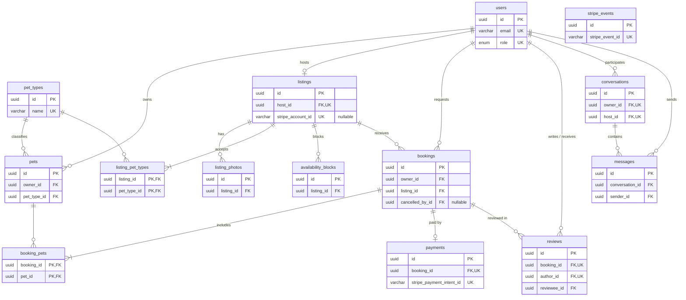

# PetHost

### O que o MVP tem, o que não tem, e por quê

_Documento de escopo · versão enxuta · outubro de 2026 · Dicionário de dados completo em [`dicionario-de-dados.md`](dicionario-de-dados.md)_

---

**Em uma frase.** O PetHost é o "deixa com o vizinho" que funciona: qualquer pessoa com espaço e jeito com bicho abre um **cantinho** na própria casa para hospedar pets, e quem vai viajar encontra alguém de confiança perto de casa, conversa, paga e fica tranquilo.

> **O MVP está pronto quando…**
>
> A Camila acha a Dona Cida no Jardim Alvorada, conversa com ela pelo chat, reserva 5 noites para a Pipoca, paga com Pix ou cartão, recebe foto da Pipoca durante a viagem, busca a Pipoca e avalia. E a Dona Cida recebe o dinheiro dela na conta.
>
> Tudo isso **sem ninguém sair do PetHost**. O que não for necessário para essa história acontecer, fica para depois.

*Como ler: as seções 1 a 3 são o essencial (10 minutos). O resto é consulta.*

## 1. Para quem é

Cada funcionalidade do PetHost existe para responder a um medo concreto de alguém. Se uma tela não responde a nenhum desses medos, ela provavelmente não precisa existir no MVP.

#### Camila, a tutora

31 anos, analista, mora num apartamento na Zona 7, em Maringá. Tem a Pipoca, vira-lata de 4 anos, porte médio, morre de medo de fogos. Vai passar o Natal com os pais em Curitiba. Hotel de pet é caro e a Pipoca fica numa baia.

**Medo:** "Quem é essa pessoa? Vão dar o remédio na hora? Vou ficar sem notícia?"

**Precisa:** ver quem é a pessoa e a casa, conversar antes de fechar, receber foto durante a viagem.

#### Dona Cida, a anfitriã

58 anos, aposentada, casa com quintal murado no Jardim Alvorada. Já criou três cachorros; hoje tem o Bóris, um labrador idoso e calmo. Quer uns R$ 800 a mais por mês. Usa WhatsApp, mas não é "da tecnologia".

**Medo:** "E se vier um cachorro bravo? E se destruir minha casa? E se não me pagarem?"

**Precisa:** saber exatamente que bicho vem, poder recusar, ter certeza de que vai receber, e telas simples com botões grandes.

#### Lucas, o anfitrião de apartamento

24 anos, estudante, trabalha de casa num apê pequeno perto da UEM. Só aceita gatos e pets pequenos. É por causa dele que tipo e porte aceitos importam tanto.

**Medo:** "Vão me mandar um pastor-alemão."

**Precisa:** filtrar quem pode pedir, antes do pedido chegar.

### Medo → o que o PetHost faz

| Medo                                 | Resposta no produto                                                                                                 |
|------------------------------------------|-------------------------------------------------------------------------------------------------------------------------|
| **"Não sei quem é essa pessoa" (tutor)** | Anfitrião verificado pelo Stripe + aprovado pelo admin, avaliações públicas, selos e conversa antes de reservar.        |
| **"Vou ficar sem notícia" (tutor)**      | Chat com foto durante a estadia. O chat é o diário.                                                                     |
| **"Vão esquecer o remédio" (tutor)**     | A ficha do pet vai junto com a reserva: remédio, horário, alimentação, manias.                                          |
| **"Vai vir um bicho bravo" (anfitrião)** | Anfitrião escolhe tipos e portes aceitos, lê a ficha antes e aceita ou recusa cada pedido. Aviso "Combina com seu pet". |
| **"Não vão me pagar" (anfitrião)**       | O tutor paga antes da estadia. O PetHost segura o dinheiro e repassa no check-out.                                      |
| **"Paguei e o anfitrião sumiu" (tutor)** | Se o anfitrião cancelar, o tutor recebe 100% de volta.                                                                  |

## 2. O jeito do PetHost

A ideia é que o produto não pareça um sistema genérico. Ele tem quatro princípios, e eles valem para texto, tela e regra de negócio:
- **Pet tem nome.** Se sabemos o nome, usamos. "A Pipoca chegou na casa da Dona Cida", nunca "Check-in realizado".
- **Bairro, não coordenada.** Mostramos "Jardim Alvorada · 2 km de você". Confiança nasce da proximidade.
- **Capacidade honesta.** O anfitrião diz quantos pets cabem ao mesmo tempo, e o sistema nunca passa disso. Quem cuida de três não recebe o quarto.
- **Sem letra miúda.** O valor total aparece desde o primeiro clique. O tutor paga exatamente o que vê.

### Tom de voz: fala como vizinho, não como banco

| Em vez de…               | Escreva…                                                                           |
|------------------------------|----------------------------------------------------------------------------------------|
| Reserva confirmada.          | Fechado! A Dona Cida espera a Pipoca dia 20, a partir das 14h.                         |
| Nenhum resultado encontrado. | Ninguém livre por aqui nessas datas. Que tal aumentar a distância?                     |
| Check-in realizado.          | A Pipoca chegou!                                                                       |
| Pagamento aprovado.          | Pagamento guardado com a gente. A Dona Cida só recebe quando a Pipoca voltar pra casa. |
| Campo obrigatório.           | Falta dizer o porte da Pipoca.                                                         |

### As duas metáforas pedidas pela disciplina
- **Vizinhança** organiza a descoberta: busca por bairro, distância, selo "Vizinho", reputação local.
- **Hospedagem** organiza a estadia: cantinho, reserva, chegada, "voltou pra casa", avaliação.

## 3. O que tem e o que não tem

### 3.1 Entra no MVP

| Funcionalidade          | Como fica (versão simples)                                                                                                                                                                                                         |
|-----------------------------|----------------------------------------------------------------------------------------------------------------------------------------------------------------------------------------------------------------------------------------|
| **Contas separadas**        | Conta de **tutor** ou de **anfitrião**, escolhida no cadastro. Pode usar o mesmo e-mail nas duas. Admin é criado direto no banco.                                                                                                      |
| **Tipos de pet**            | Lista mantida pelo admin: Cachorro, Gato, Pequenos animais. Porte (P, M, G) só para cachorro.                                                                                                                                          |
| **Cadastro de pet (ficha)** | Nome, foto, tipo, raça (texto livre), porte, idade, sexo, castrado, vacinas em dia, remédio e horário, alimentação, se dá bem com cães, gatos e crianças, veterinário e "coisas que só quem convive sabe".                             |
| **Cantinho**                | Fotos (até 5), descrição, bairro e endereço, tipo de casa, tem quintal, tem cães, gatos ou crianças em casa, tipos e portes aceitos, capacidade (quantos pets ao mesmo tempo, de tutores diferentes), diária por pet, regras da casa.  |
| **Agenda**                  | Tudo disponível por padrão. O anfitrião bloqueia datas. Estadias pagas bloqueiam sozinhas.                                                                                                                                             |
| **Verificação**             | Cadastro de recebimento no Stripe (CPF, documento, banco) + ok do admin. Sem os dois, o cantinho não aparece na busca.                                                                                                                 |
| **Busca**                   | Bairro ou cidade + datas + qual pet vai. Resultado em lista com foto, bairro, distância, preço, nota e selos.                                                                                                                          |
| **Chat**                    | Botão "Puxar conversa" no cantinho. Texto e foto. Uma conversa por dupla tutor–anfitrião. Durante a estadia, é ali que chegam as fotos.                                                                                                |
| **Reserva**                 | Pedir → anfitrião aceita ou recusa (24h) → tutor paga (24h) → confirmada → "chegou" → "voltou pra casa".                                                                                                                               |
| **Pagamento**               | Stripe Connect com checkout transparente: cartão e Pix dentro do PetHost. Detalhes na seção 6.                                                                                                                                         |
| **Avaliação**               | Depois do check-out, cada lado avalia o outro: nota de 1 a 5 e comentário, em até 7 dias.                                                                                                                                              |
| **Selos automáticos**       | Calculados, não cadastrados: Vizinho, Responde rápido, Casa com quintal, Experiente, Bem avaliado (regras na seção 7).                                                                                                                 |
| **"Combina com seu pet"**   | Ao ver um cantinho, o sistema cruza a ficha do pet com a casa e com os outros hóspedes do período: "A Pipoca não se dá com gatos e aqui tem gato" ou "Nessas datas a Dona Cida também recebe o Thor, cão grande". Avisa, não bloqueia. |
| **Painel do anfitrião**     | Pedidos novos, próximas estadias e quanto recebeu no mês.                                                                                                                                                                              |
| **Admin mínimo**            | Aprovar anfitriões e gerenciar tipos de pet. Duas telas.                                                                                                                                                                               |

### 3.2 Fica de fora

| Item                                               | Por quê                                                         |
|--------------------------------------------------------|---------------------------------------------------------------------|
| **App nativo**                                         | A versão web responsiva já roda no celular.                         |
| **Mapa**                                               | Bairro e distância bastam para a vizinhança. Entra se sobrar tempo. |
| **Diário separado**                                    | O chat com foto faz esse papel.                                     |
| **Upload próprio de documentos**                       | O cadastro do Stripe já coleta. Não reinventamos.                   |
| **Notificação push e por e-mail**                      | Aviso dentro do app (contador de não lidas).                        |
| **Áudio, vídeo, "digitando…", confirmação de leitura** | Não muda a confiança; custa tempo.                                  |
| **Preço por temporada, desconto semanal, cupom**       | Diária fixa por pet resolve.                                        |
| **Seguro, cobertura veterinária, mediação de disputa** | Envolvem parceria e análise jurídica.                               |
| **Passeio, creche, banho**                             | Outro modelo de reserva (por hora).                                 |
| **Várias cidades e idiomas**                           | Piloto só em Maringá.                                               |

### 3.3 Se sobrar tempo (nessa ordem)
1. Recuperar senha por e-mail.
2. Mapa com Leaflet e OpenStreetMap (gratuito).
3. Avisos por e-mail (pedido novo, pagamento confirmado).
4. Filtro por faixa de preço.

## 4. Contas e o que cada uma vê

| Conta     | Menu                                                                 | Pode                                                                                                           |
|---------------|--------------------------------------------------------------------------|--------------------------------------------------------------------------------------------------------------------|
| **Tutor**     | Buscar · Meus pets · Minhas estadias · Conversas · Perfil                | Cadastrar pets, puxar conversa, pedir e pagar estadia, cancelar, avaliar o anfitrião.                              |
| **Anfitrião** | Meu cantinho · Agenda · Pedidos · Estadias · Conversas · Ganhos · Perfil | Montar o cantinho, conectar o Stripe, bloquear datas, aceitar ou recusar, marcar chegada e saída, avaliar o tutor. |
| **Admin**     | Anfitriões aguardando · Tipos de pet                                     | Aprovar ou recusar anfitrião, manter a lista de tipos.                                                             |

**Login com o mesmo e-mail:** a tela de entrar tem a escolha "Sou tutor / Sou anfitrião". O e-mail é único **dentro de cada tipo**, então a Dona Cida pode ter as duas contas com o mesmo e-mail, cada uma com sua senha.

## 5. Como uma estadia acontece
1. A Camila busca por "Zona 7", de 20 a 25 de dezembro, para a Pipoca. Aparecem só os cantinhos que aceitam cachorro médio e têm vaga nessas datas.
2. Ela abre o cantinho da Dona Cida e vê o aviso "A Pipoca combina com essa casa". Toca em **Puxar conversa** e pergunta sobre fogos.
3. Pede a estadia: datas, Pipoca, total de R$ 300 (R$ 60 × 5 noites × 1 pet). Status: **Solicitada**.
4. A Dona Cida lê a ficha e aceita. Status: **Aceita**. A Camila tem 24h para pagar.
5. A Camila paga com Pix dentro do PetHost. O Stripe confirma por webhook. Status: **Confirmada**. O endereço exato e o telefone são liberados.
6. No dia 20, a Dona Cida toca em **A Pipoca chegou**. Status: **Em andamento**. As fotos vão pelo chat.
7. No dia 25, toca em **A Pipoca voltou pra casa**. Status: **Concluída**. O repasse de 90% vai para a conta Stripe dela.
8. As duas se avaliam em até 7 dias.

| Status       | Quando                         | Para onde vai                                          |
|------------------|------------------------------------|------------------------------------------------------------|
| **Solicitada**   | Tutor pediu                        | Aceita, Recusada, Expirada (24h sem resposta) ou Cancelada |
| **Aceita**       | Anfitrião aceitou                  | Confirmada (pagou), Expirada (24h sem pagar) ou Cancelada  |
| **Confirmada**   | Pagamento confirmado pelo Stripe   | Em andamento ou Cancelada (com reembolso)                  |
| **Em andamento** | Anfitrião marcou "chegou"          | Concluída                                                  |
| **Concluída**    | Anfitrião marcou "voltou pra casa" | Fim. Libera repasse e avaliação.                           |

## 6. Pagamento com Stripe Connect

O PetHost é a plataforma no Stripe; cada anfitrião é uma **conta conectada**. Usamos o modelo de **cobrança e transferência separadas**: o tutor paga o PetHost, e o PetHost transfere para o anfitrião só no fim. Tudo em **modo de teste** (sem dinheiro de verdade).

| Etapa             | O que acontece                                                                                                                                                                                        |
|-----------------------|-----------------------------------------------------------------------------------------------------------------------------------------------------------------------------------------------------------|
| **Anfitrião conecta** | Ao montar o cantinho, faz o cadastro de recebimento com o componente embutido do Stripe. Guardamos o listings.stripe_account_id e só liberamos o cantinho quando o Stripe avisa que a conta pode receber. |
| **Tutor paga**        | A API cria a cobrança (valor total, BRL, ligada à reserva). A tela usa o Payment Element: cartão e Pix dentro do PetHost, QR code do Pix na própria página.                                               |
| **Confirmação**       | Só via webhook. A reserva vira Confirmada quando o Stripe avisa que o pagamento deu certo, nunca pelo retorno do navegador.                                                                               |
| **Repasse**           | Em "voltou pra casa", a API transfere **90%** para o anfitrião, amarrado à cobrança original. **10%** ficam com o PetHost, e é dessa parte que sai a taxa do Stripe.                                      |
| **Cancelamento**      | Como o repasse só acontece no fim, cancelar antes da chegada é só um reembolso.                                                                                                                           |

| Quem cancela | Quando                          | Tutor recebe de volta                 |
|------------------|-------------------------------------|-------------------------------------------|
| Tutor            | 48h ou mais antes da chegada        | 100%                                      |
| Tutor            | Menos de 48h antes                  | 50% (os outros 50% seguem o 90/10 normal) |
| Anfitrião        | A qualquer momento antes da chegada | 100%                                      |

> **Para testar na semana 1**
>
> Confirmar como simular um Pix pago no modo de teste e usar a Stripe CLI para mandar webhooks para a máquina local. É a parte mais nova para o grupo; melhor descobrir cedo.

## 7. Regras que valem
1. Cantinho só aparece na busca com Stripe liberado + ok do admin + status ativo.
2. **Capacidade:** em nenhum dia do período a soma dos pets de reservas Confirmadas ou Em andamento, mais os pets do novo pedido, pode passar da capacidade do cantinho. Tutores diferentes podem dividir o mesmo período.
3. Uma reserva é de um tutor só e leva 1 ou mais pets dele. Todos precisam ser de tipo e porte aceitos. A busca só mostra cantinhos com vaga para todos os pets escolhidos.
4. Valor = diária × noites × número de pets. Noites = data de saída − data de chegada.
5. Anfitrião tem 24h para responder; tutor tem 24h para pagar depois do aceite. Senão, Expirada.
6. Datas só ficam bloqueadas quando a reserva é paga (Confirmada).
7. Antes do pagamento, o tutor vê só o bairro. Endereço e telefone aparecem depois.
8. O tutor leva a ração e entrega o remédio. A tela de pedido lembra disso, e o tutor confirma.
9. Avaliação: só depois de Concluída, uma por lado, em até 7 dias, nota inteira de 1 a 5.
10. Selos: **Vizinho** = mesmo bairro do tutor · **Responde rápido** = média de resposta abaixo de 2h · **Casa com quintal** = marcado no cantinho · **Experiente** = 5+ estadias concluídas · **Bem avaliado** = nota 4,5+ com 3+ avaliações.
11. "Combina com seu pet": compara "se dá bem com cães, gatos e crianças" do pet com "tem cães, gatos e crianças" da casa. Só avisa.

## 8. Modelo entidade-relacionamento

Modelo lógico do MVP: 14 tabelas. Nomes em inglês e snake_case, no padrão de mercado; o app continua em português. O **dicionário de dados** ([`dicionario-de-dados.md`](dicionario-de-dados.md)) explica cada tabela e coluna.

| No app                    | No banco                      |
|-------------------------------|-----------------------------------|
| **Tutor · Anfitrião · Admin** | users.role = owner · host · admin |
| **Cantinho**                  | listings                          |
| **Reserva / estadia**         | bookings                          |
| **Avaliação**                 | reviews                           |
| **Conversa · Mensagem**       | conversations · messages          |

Notação pé-de-galinha (no Mermaid): `||` exatamente um · `o{` zero ou muitos · `|{` um ou muitos · `o|` zero ou um. **PK** chave primária · **FK** chave estrangeira · **UK** único (mesmo número = único composto) · `"nullable"` aceita nulo.

_Aqui só as chaves. Todas as colunas estão no dicionário de dados e na versão em imagem: [`er.png`](er.png)._

### Relacionamentos e cardinalidade

| Relacionamento                 | Cardinalidade | Observação                                   |
|------------------------------------|-------------------|--------------------------------------------------|
| **users → pets**                   | 1 : N             | Só contas owner têm pets.                        |
| **pet_types → pets**               | 1 : N             | size só é preenchido se has_size.                |
| **users → listings**               | 1 : 0..1          | Uma conta host tem no máximo um cantinho.        |
| **listings → listing_photos**      | 1 : N             | Até 5 fotos.                                     |
| **listings → pet_types**           | N : N             | Com pet_types, via listing_pet_types.            |
| **listings → availability_blocks** | 1 : N             | Períodos fechados pelo anfitrião.                |
| **users → bookings**               | 1 : N             | O tutor faz várias reservas.                     |
| **listings → bookings**            | 1 : N             | Várias no mesmo período, limitadas por capacity. |
| **bookings → pets**                | N : N             | Com pets, via booking_pets.                      |
| **bookings → payments**            | 1 : 0..1          | Criado quando o tutor vai pagar.                 |
| **bookings → reviews**             | 1 : 0..2          | Uma por lado.                                    |
| **users → reviews**                | 1 : N             | author_id e reviewee_id.                         |
| **users → conversations**          | 1 : N             | owner_id e host_id; uma por dupla.               |
| **conversations → messages**       | 1 : N             |                                                  |
| **users → messages**               | 1 : N             | sender_id.                                       |

### Restrições que o modelo precisa garantir
1. users: (email, role) único. O mesmo e-mail pode existir uma vez como owner e uma vez como host.
2. pets.owner_id, bookings.owner_id e conversations.owner_id apontam para users com role = owner; listings.host_id e conversations.host_id para role = host. Validado na aplicação.
3. booking_pets: todo pet precisa ser do mesmo tutor da reserva, e de tipo e porte aceitos pelo cantinho.
4. bookings: check_out_date \> check_in_date; pet_count = linhas em booking_pets; nightly_rate_cents é cópia do preço no momento do pedido.
5. Capacidade: em nenhum dia, a soma de pet_count das reservas confirmed ou in_progress do cantinho passa de listings.capacity.
6. Dinheiro sempre em centavos inteiros (\*\_cents), como o Stripe. payments: platform_fee_cents + host_payout_cents = amount_cents − refunded_cents.
7. reviews.rating entre 1 e 5; só para bookings com status completed.
8. stripe_events.stripe_event_id único: webhook repetido não é processado duas vezes.
9. Nada com histórico é apagado: pets e cantinhos são desativados (is_active, status).

## 9. Telas

| Quem      | Telas                                                                                                                                                                                        |
|---------------|--------------------------------------------------------------------------------------------------------------------------------------------------------------------------------------------------|
| **Todos**     | Entrar · Criar conta · Conversas · Conversa · Perfil                                                                                                                                             |
| **Tutor**     | Buscar · Resultados · Cantinho (detalhe) · Meus pets · Ficha do pet · Pedir estadia · Pagar · Minhas estadias · Estadia · Avaliar                                                                |
| **Anfitrião** | Montar meu cantinho (passo a passo, com simulação de quanto pode ganhar) · Conectar Stripe · Agenda · Pedidos · Pedido (com a ficha do pet) · Estadias · Estadia em andamento · Ganhos · Avaliar |
| **Admin**     | Anfitriões aguardando · Tipos de pet                                                                                                                                                             |

O protótipo HTML atual serve como **mapa de telas**, não como visual final. O visual deve seguir a seção 2: pouca coisa por tela, botões grandes (pensando na Dona Cida), textos com o nome do pet e a ficha do pet com cara de carteirinha.

## 10. Plano de 4 semanas

| Semana | Entrega                                                                                                                                                              |
|------------|--------------------------------------------------------------------------------------------------------------------------------------------------------------------------|
| **1**      | Base: projeto .NET, banco, login com dois tipos de conta, tipos de pet, ficha do pet. Decidir o front. Teste isolado do Stripe (Pix em modo de teste + webhook local).   |
| **2**      | Cantinho + conexão com Stripe, ok do admin, agenda, busca, tela do cantinho com selos e "Combina com seu pet".                                                           |
| **3**      | Reserva completa (pedir, aceitar, recusar, expirar), pagamento com Payment Element, webhook, chegada e saída, repasse, chat.                                             |
| **4**      | Avaliação, cancelamento com reembolso, painel do anfitrião, revisão de todos os textos no tom da seção 2, dados de demonstração com bairros de Maringá, testes e ensaio. |

## 11. Em aberto e o que mudou

### Decisões em aberto
- **Front-end.** Recomendação: React, porque o Payment Element e o cadastro embutido do Stripe têm versão oficial para React. Blazor ou Razor funcionam, mas precisam de ponte com JavaScript.
- **Banco.** PostgreSQL ou SQL Server. Escolher o que mais gente do grupo já conhece.
- **Chat em tempo real.** SignalR (já vem no ASP.NET Core) ou consulta a cada poucos segundos. Começar pela consulta e trocar se der tempo.
- **Fotos.** Pasta local no servidor no MVP.

### O que muda em relação à versão anterior

| Antes                                            | Agora                                             |
|------------------------------------------------------|-------------------------------------------------------|
| Uma conta com modo tutor e modo anfitrião            | Duas contas separadas (pode usar o mesmo e-mail)      |
| Sem pagamento; tutor e anfitrião combinavam por fora | Stripe Connect com cartão e Pix, repasse no check-out |
| Sem chat; telefone liberado após confirmação         | Chat com texto e foto                                 |
| Diário da estadia como módulo próprio                | Fotos pelo chat                                       |
| Verificação com selfie, documento, CPF e comprovante | Cadastro do Stripe + ok do admin                      |
| Busca com mapa e raio                                | Busca por bairro, mapa só se sobrar tempo             |
| Raças cadastradas pelo admin, recusa por raça        | Raça em texto livre; filtro por tipo e porte          |

**Mantido da versão anterior:** API em ASP.NET Core, JWT, testes com xUnit, Git e GitHub, ração e remédio por conta do tutor, taxa de 10%.

### Ideias guardadas para depois
- **Boletim do dia:** chips "Comeu bem / Passeou / Tomou remédio / Dormiu bem" + foto, viram um card no chat.
- **Checklist de chegada:** ao marcar "chegou", confirmar ração, remédio e coleira.
- **Botão de emergência:** veterinário do pet e contato do tutor em um toque.
- **Currículo do pet:** o anfitrião também avalia o pet; o histórico ajuda nas próximas estadias.
- **Cartão-postal da estadia:** as fotos do chat viram um álbum no fim.
- **Visita de reconhecimento:** propor pelo chat uma visita antes da estadia.
